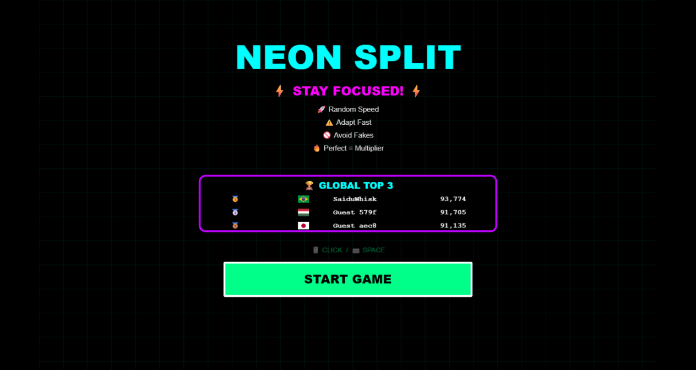
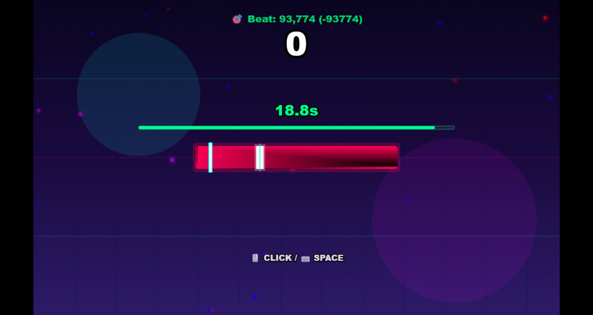
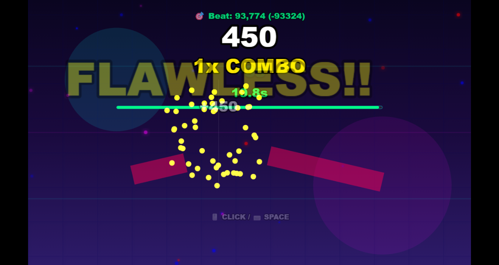
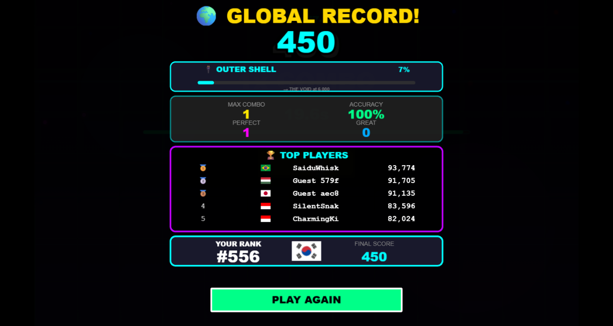

# Neon Split (네온 스플릿)



> **네온 사이버펑크 감성의 고속 타이밍 & 리듬 리액션 아케이드 웹 게임**  
> 좌우로 질주하는 네온 커서를 목표 지점에 완벽히 맞추어 바를 두 동강 내고, 콤보와 점수를 쌓아 글로벌 랭킹 정상을 차지하세요!

자세한 설명 및 스크린 샷은 info 폴더에서 확인하실 수 있습니다.

---

## 인게임 플레이 화면

|           시작 & 글로벌 랭킹 화면            |                 인게임 플레이 화면                 |
| :------------------------------------------: | :------------------------------------------------: |
|  |  |
|  **타격 판정 & 바 분할 연출 (FLAWLESS!!)**   |               **결과 및 통계 화면**                |
|   |      |

---

## 게임 조작 방법

- **PC**: 마우스 좌클릭 또는 키보드 `Space` 키
- **모바일 / 태블릿**: 화면 터치 (Tap)

---

## ⚡ 게임 규칙 & 메커니즘

### 1. 기본 규칙

- 게임 시작 시 **20초**의 제한 시간이 주어집니다.
- 좌우로 왕복 이동하는 흰색 네온 커서가 중앙의 **타깃 존(Target Zone)**에 도달했을 때 입력합니다.
- 정확도에 따라 판정이 결정되며, 남은 시간 증감과 점수, 콤보가 적용됩니다.
- 제한 시간이 **0초**가 되면 게임이 종료됩니다.

### 2. 판정 시스템 (Judgment)

|      판정      |           조건            | 획득 기본 점수  | 시간 보너스 | 연출 & 효과                                                           |
| :------------: | :-----------------------: | :-------------: | :---------: | :-------------------------------------------------------------------- |
| **FLAWLESS!!** | 정확도 99% 이상 & Perfect | 450+ 점 (1.5배) |  **+3초**   | 대형 텍스트, 화면 플래시, 황금 파티클 50개 폭발                       |
|  **PERFECT!**  |      정확도 90% 이상      |     300 점      |  **+3초**   | 박수 효과음, 화면 쉐이크/플래시, 파티클 35개 폭발, 3연속 시 배율 증가 |
|   **GREAT**    |      정확도 85% 이상      |     150 점      |  **+2초**   | 콤보 유지, 파티클 18개 폭발                                           |
|    **GOOD**    |      정확도 70% 이상      |      50 점      |  **+1초**   | 콤보 -1 차감, 배율 -0.2 감소                                          |
|    **MISS**    |      정확도 70% 미만      |      0 점       |  **-3초**   | 콤보 초기화, 배율 1x 초기화, 화면 쉐이크                              |
|   **FAKE!**    |      가짜 타깃 적중       |      0 점       |  **-3초**   | 콤보 -5 차감, 배율 1x 초기화, 경고음 및 강한 쉐이크                   |

### 3. 타이밍 바 변칙 기믹 (Bar Gimmicks)

1. **Normal Bar**: 표준 너비와 속도의 네온 바 (콤보에 따라 바 색상 실시간 변화)
2. **Speed Bar (빨강)**: 1.5배 빠른 속도로 커서가 질주
3. **Slow Bar (초록)**: 0.7배 속도의 넓고 느린 안정형 바
4. **Tiny Bar (마젠타)**: 좁은 폭으로 고도의 집중력이 필요한 바
5. **Bonus Bar (골드)**: 점수 **3배** 보너스 획득 기회
6. **Fake Target (가짜 타깃)**: 빨간 경고색 가짜 영역. 커서가 이곳에 있을 때 입력하면 페널티
7. **Speed Trap (속도 함정)**: 바의 특정 구간 통과 시 커서 속도가 급가속/감속
8. **Ghost Mode (고스트 모드)**: 텔레포트 존 진입 시 커서가 투명해지며 잔상만 남음

---

## 스테이지 시스템 (Progression Stages)

점수가 상승함에 따라 배경 비주얼과 음악의 분위기가 단계별로 진화합니다.

|  스테이지   | 이름            | 기준 점수  |  테마 컬러 & 이모지   | 배경 효과                            |
| :---------: | :-------------- | :--------: | :-------------------: | :----------------------------------- |
| **Stage 0** | **OUTER SHELL** |    0 점    |  `Cyan` (`#00ffff`)   | 기초 회로 네온 그리드                |
| **Stage 1** | **THE VOID**    |  6,000 점  | `Orange` (`#ff6600`)  | 심연 공간 및 원형 파동 버스트        |
| **Stage 2** | **DATA STREAM** | 24,000 점  |  `Green` (`#00ff88`)  | 실시간 매트릭스 데이터 스트림 라인   |
| **Stage 3** | **CORE BREACH** | 50,000 점  | `Magenta` (`#ff00ff`) | 시스템 과부하 글리치 & 스트롭 플래시 |
| **Stage 4** | **SINGULARITY** | 80,000 점  |  `White` (`#ffffff`)  | 특이점 중심 수렴 파티클              |
| **Stage 5** | **ASCENSION**   | 120,000 점 |  `Gold` (`#ffdd00`)   | 무한 확장 펄스 링 연출               |

---

## 글로벌 리더보드 & 플랫폼 연동

- **Firebase Realtime Database**: 전 세계 플레이어의 최고 기록 실시간 동기화
- **FlagCDN 연동**: 플레이어 접속 국가 기반 50개국 이상의 국기 아이콘 자동 매핑
- **CrazyGames SDK v3**:
  - `gameplayStart` / `gameplayStop` 라이프사이클 관리
  - 유저네임 자동 연동
  - 신기록 달성 시 축하 연출 (`happytime`)
  - 게임 플레이 주기별 스마트 광고 (`requestAd('midgame')`)

---

## 소프트웨어 아키텍처 (MVC Pattern)

명확한 책임 분리를 위해 Model, View, Controller로 나뉜 MVC 패턴으로 리팩토링 하였습니다.

```
src/
├── model/                  # [Model] 데이터 상태 및 비즈니스 판정
│   ├── GameStateModel.ts   # 점수, 콤보, 시간, 배율, 통계
│   ├── TimingBarModel.ts   # 바 생성, 타깃 오프셋, 적중 판정 계산
│   ├── StageModel.ts       # 스테이지 단계 및 진행도 계산
│   ├── LeaderboardModel.ts # Firebase RTDB API 및 로컬 백업
│   └── MainModel.ts        # ★ Model 통합 조립점
│
├── view/                   # [View] 그래픽 렌더링 및 시각 연출
│   ├── BackgroundView.ts   # 캔버스 동적 그라디언트, 그리드, 앰비언트 효과
│   ├── TimingBarView.ts    # 바 그래픽, 커서 이동, 바 분할(Split) 연출
│   ├── HUDView.ts          # 점수, 콤보, 타이머, 프로그레스 바
│   ├── FXView.ts           # ★ 연출 전담 (파티클, 플래시, 쉐이크, 팝업)
│   ├── StartScreenView.ts  # 타이틀, 룰 안내, TOP 3 랭킹 카드
│   ├── ResultScreenView.ts # 최종 통계, 순위 변동, 플레이 어게인 버튼
│   ├── TutorialView.ts     # 조작 힌트 툴팁
│   └── MainView.ts         # ★ View 통합 조립점
│
├── controller/             # [Controller] 사용자 입력 및 흐름 제어
│   ├── InputController.ts  # ★ 클릭/터치/스페이스바 입력 및 입력 락 제어
│   ├── GameFlowController.ts# 게임 루프, 카운트다운 사운드, SDK 연동
│   └── MainController.ts   # ★ Controller 통합 조립점 (Model ↔ View 조율)
│
└── scene/
    └── Interaction.ts      # MainController에 라이프사이클을 위임하는 경량 Phaser Scene
```

---

## 🚀 실행 및 빌드

```bash
# 개발 서버 실행
npm start

# 프로덕션 빌드 (Parcel v2)
npm run build
```
